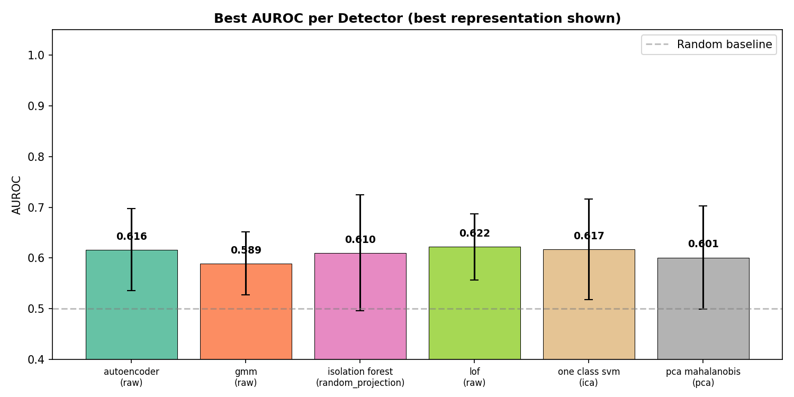
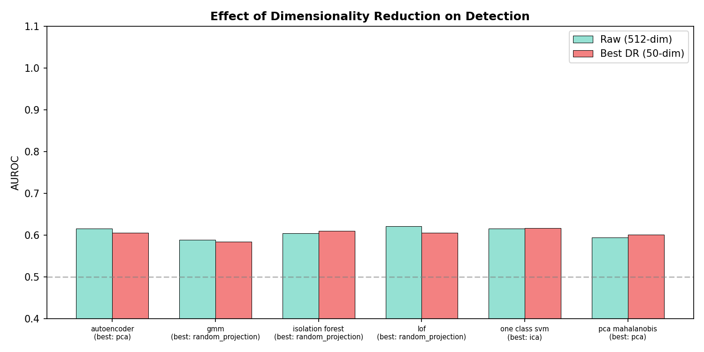
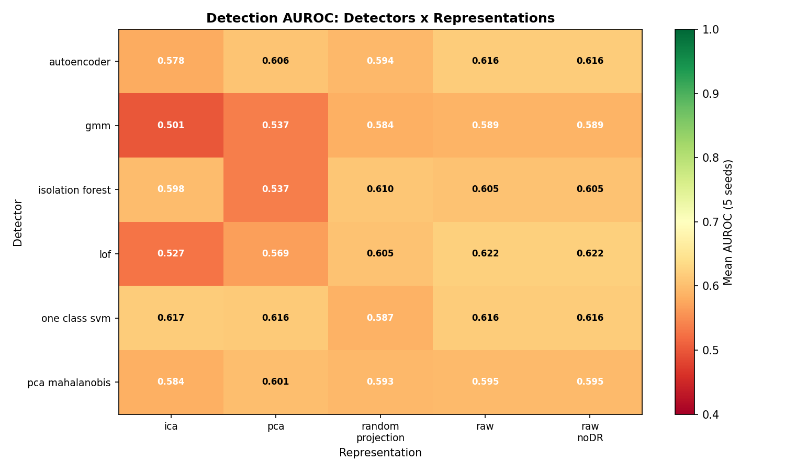
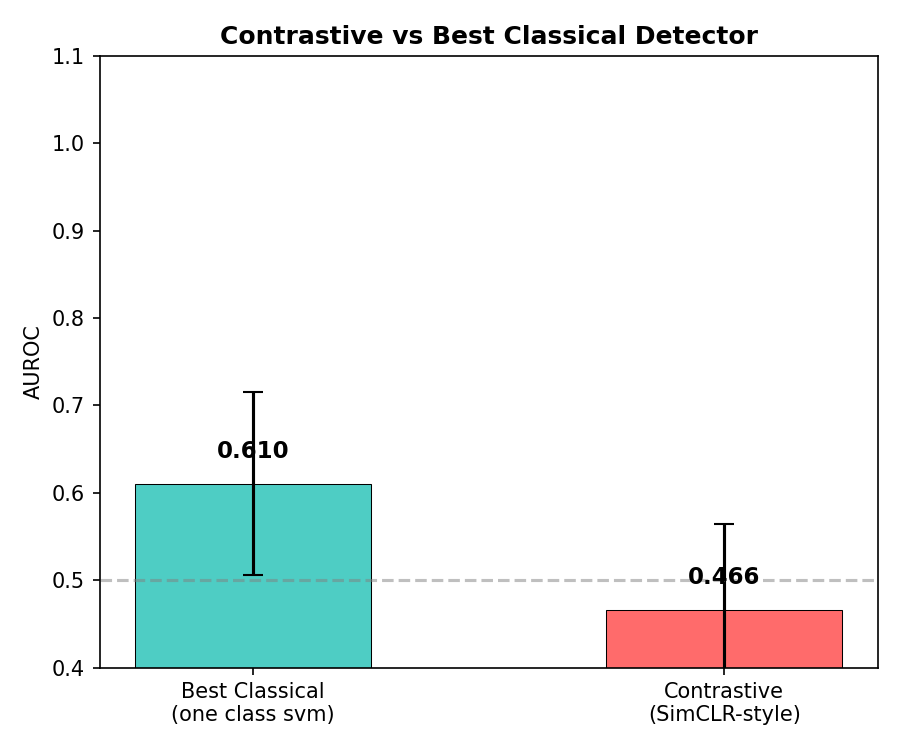

# Dimensionality Reduction Makes Backdoor Detection Worse, Not Better

*What 150 experiments taught me about unsupervised model supply chain security.*

---

You download a pre-trained model from a public registry. It passes all your standard checks -- accuracy looks right, loss is normal, ModelScan finds no serialization exploits. But someone poisoned the training data, and the model has a behavioral backdoor that activates only on specific inputs. How do you catch it?

I built a behavioral fingerprinting pipeline that probes models with reference inputs, collects activation vectors from intermediate layers, and runs 6 unsupervised anomaly detectors to flag suspicious models. No labeled training data required. 150 experiments across 5 seeds, pure CPU, and the results challenged several assumptions.

## The Setup

The pipeline generates synthetic model fingerprints: 128-dimensional activation vectors for 160 clean models and 40 test models (8 with injected backdoors) per seed. The backdoor is deliberately diffuse -- a subtle perturbation distributed across many activation dimensions, mimicking training-data poisoning rather than a concentrated trigger patch.

Six detectors from three algorithm families:
- **Density-based:** Local Outlier Factor (LOF), Gaussian Mixture Model (GMM)
- **Boundary-based:** One-Class SVM (OCSVM), Isolation Forest (IF)
- **Reconstruction-based:** Autoencoder (AE), PCA + Mahalanobis distance

Each detector runs on 5 representations: raw features, PCA, ICA, Random Projection, and (for one detector) the identity baseline. That is 6 detectors x 5 representations x 5 seeds = 150 runs, plus a SimCLR contrastive learning baseline.

## Finding 1: It Works, But Modestly

All 6 detectors on raw features exceed random chance (AUROC 0.50), with mean AUROC ranging from 0.589 (GMM) to 0.622 (LOF). Detection rate at FPR=10% averages 22-28%.

This means: with zero labeled examples, the pipeline flags about 1 in 4 backdoored models while only false-alarming on 1 in 10 clean models. Not production-ready, but a meaningful signal for a zero-label approach. The experiment contract target was AUROC >= 0.70, so this is a proof-of-concept, not a deployment.

## Finding 2: Dimensionality Reduction Hurts

This was the biggest surprise. In my CS 7641 Unsupervised Learning project, ICA + GMM clustering improved results on tabular data. I expected the same pattern here.

The opposite happened.

Raw features (AUROC 0.607) beat PCA (0.578), ICA (0.568), and Random Projection (0.596) when averaged across all detectors. Raw features win clearly for 3 of 6 detectors (LOF, Autoencoder, GMM).

The reason is structural. The CS 7641 task had concentrated independent sources -- ICA could separate them. Backdoor triggers are distributed across many activation dimensions as a subtle, diffuse perturbation. Dimensionality reduction discards exactly the low-variance, distributed signal that distinguishes poisoned models.

**Lesson:** DR is not universally helpful. When the signal you are looking for is diffuse rather than concentrated, keeping the full feature space preserves detection power.

## Finding 3: Classical Methods Beat the Autoencoder

LOF (AUROC 0.622) beats the autoencoder (0.616) and ties with OCSVM (0.616). At 128 training samples, classical non-parametric methods have a structural advantage -- they measure local density or support boundaries without needing to learn a manifold.

Autoencoders shine with abundant data. They need enough samples to learn a useful reconstruction of "normal." With 128 clean models in the training set, LOF's local density estimation is more data-efficient.

## Finding 4: Contrastive Learning Fails Spectacularly

SimCLR achieves AUROC 0.466 -- below random chance. The contrastive loss never converged to a representation that separates clean from backdoored models.

SimCLR learns augmentation-invariant representations. But there is no natural augmentation structure for model fingerprints. The standard augmentations (noise, dropout) do not correspond to the clean/backdoored distinction. Task-specific augmentations (weight perturbation, layer-specific dropout) might rescue contrastive learning, but out-of-the-box SimCLR is the wrong tool for this domain.

## The Trust Score

The practical output is a trust score that aggregates all 6 detector outputs into a single 0-100 risk rating. Models scoring above 60 are flagged for manual review. The ensemble design prevents single-detector evasion -- an attacker must defeat all 6 methods simultaneously.

## What This Means for Model Supply Chain Security

1. **Behavioral fingerprinting fills a real gap.** Static analysis (ModelScan) catches serialization exploits and known payloads. Behavioral fingerprinting catches training-data poisoning that produces no static artifact. These are complementary, not competing approaches.

2. **Start with LOF, not deep learning.** For teams with limited reference models, classical non-parametric methods provide the best signal per sample. Scale up to autoencoders when you have 1000+ reference models.

3. **Do not reduce dimensions on diffuse threats.** If your threat model involves subtle, distributed perturbations (which training-data poisoning produces), keep the full feature space. DR is for concentrated signals.

4. **The 0.607 AUROC is a floor, not a ceiling.** These results use synthetic data with deliberately subtle triggers. Real backdoors (BadNets, Blended, WaNet) may produce more concentrated signatures that are easier to detect. TrojAI benchmark validation is the next step.

The pipeline, raw data (150 JSON files), and figure generation scripts are open-source in the repository.

---

*This is part of a series on agent security architecture. Previous: [RL Agent Vulnerability](link) (FP-12). The Adversarial Controllability Analysis framework connects FP-01, FP-02, FP-12, and FP-13 into a unified threat model.*
